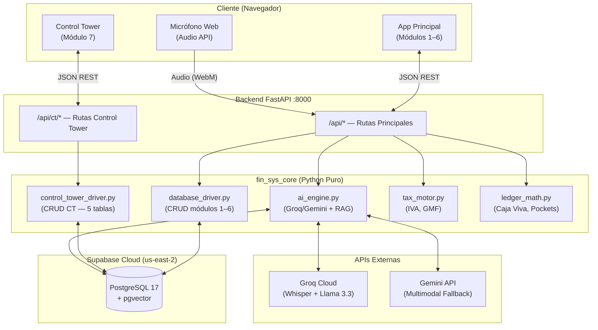
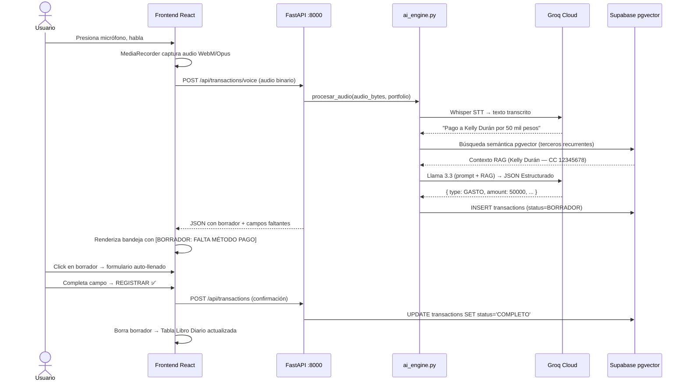
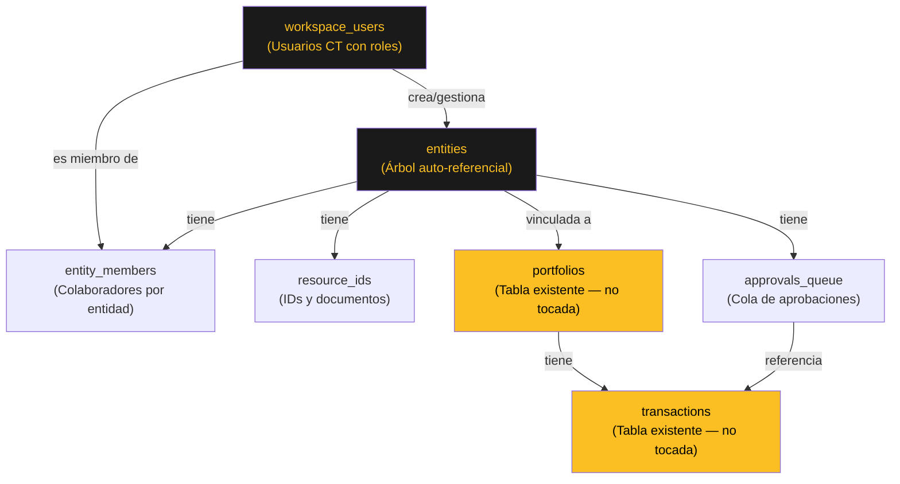
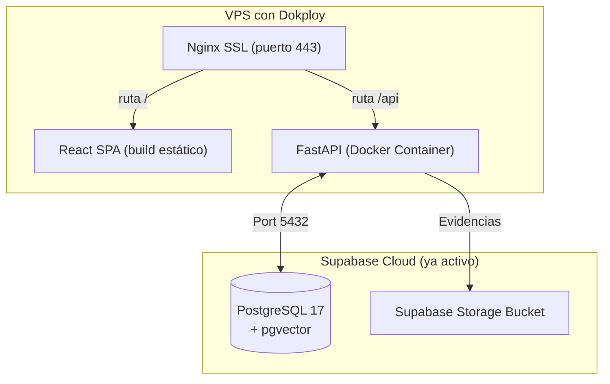

# 🏙️ FIN-SYS OS v2.0 — Especificación de Arquitectura del Sistema

> **Última actualización**: 18 Junio 2026

---

## 1. Diseño Modular de Alto Nivel



---

## 2. Capas Desacopladas

### A. Frontend (React + Vite)
- **Módulos 1–6** (`App.jsx`): Dashboard brutalista con Caja Viva, Libro Diario, Formulario de Registro, Micrófono, Borradores, Perfil, Cuentas
- **Módulo 7** (`control-tower/`): Control Tower completamente aislado. Navegación independiente. Paleta visual propia (ámbar)
- **Navegación**: `main.jsx` — 3 botones, sin routing de React Router

### B. Backend (FastAPI `server.py`)
- No contiene lógica de negocio — solo enruta y valida con Pydantic
- `on_startup`: Inicializa automáticamente todas las tablas al arrancar
- Rutas principales: `GET/POST /api/transactions`, `GET /api/balance`, `POST /api/accounts`, etc.
- Rutas CT: `GET/POST /api/ct/entities`, `GET /api/ct/entities/{id}/kpis`, `POST /api/ct/quick-transaction`, etc.

### C. Núcleo de Lógica (`fin_sys_core/` — Python Puro)

| Archivo | Responsabilidad |
|---|---|
| `database_driver.py` | Conexión, init de 10 tablas principales, CRUD transacciones/cuentas/terceros |
| `control_tower_driver.py` | CRUD de las 5 tablas CT con mock fallback |
| `hub_driver.py` | CRUD de las 10 tablas `hub_*` (Project Hub) |
| `hr_driver.py` | CRUD `hr_members`, `hr_companies`, `hr_payment_records` |
| `hr_documents_driver.py` | CRUD `hr_documents` (file_url como data URL en BD) |
| `tax_motor.py` | IVA 19%, GMF 4x1000, tasas personalizadas (aditivas/deductivas) |
| `ledger_math.py` | Caja Viva consolidada, validación de Pockets, alerta insolvencia |
| `ai_engine.py` | Groq Whisper STT + Llama 3.3 estructuración + embeddings + búsqueda RAG pgvector |
| `coa_test_module.py` | Catálogo de Cuentas dinámico (COA) por portafolio |
| `test_core.py` | Suite de 5 pruebas unitarias automáticas |

---

## 3. Flujo de Ingestión por Voz (Módulo 06)



---

## 4. Jerarquía del Control Tower (Módulo 07)



**Niveles del Árbol de Entidades**:
```
Nivel 1: HOLDING    → Mi Holding Principal
Nivel 2: EMPRESA    → Jardín Infantil Pegasus / Consultora Digital / Constructora Norte
Nivel 3: SUB_EMPRESA → Sede Norte — Pegasus
Nivel 4: PROYECTO   → Proyecto ERP — Cliente Minero
Nivel 5: TAREA      → Fase 1: Levantamiento de Requisitos
```

**KPI Consolidado (CTE recursivo)**:
```sql
WITH RECURSIVE entity_tree AS (
    SELECT id, portfolio_id FROM entities WHERE id = :entity_id
    UNION ALL
    SELECT e.id, e.portfolio_id FROM entities e
    JOIN entity_tree et ON e.parent_id = et.id
)
SELECT SUM(net_value) FROM transactions
WHERE portfolio_id IN (
    SELECT DISTINCT portfolio_id FROM entity_tree WHERE portfolio_id IS NOT NULL
)
```

---

## 5. Estrategia de Producción (Roadmap)



**Pendiente para producción**:
1. Crear `Dockerfile` para el backend FastAPI
2. Compilar frontend: `npm run build`
3. Configurar Nginx y SSL en Dokploy
4. Migrar `on_event("startup")` a `lifespan` handler
5. Cambiar hash MD5 de CT por bcrypt + JWT

---

## 7. Módulo 08c — RRHH / Empresas

### Componentes UI
```
project-hub/features/members/
├── RRHHView.jsx           ← Vista principal del módulo (contenedor)
├── CompanyMapTab.jsx      ← Árbol jerárquico Holding→Empresa→Sub→Proyecto
├── MemberProfile.jsx      ← Perfil con pestañas Documentos | Historial
└── tabs/
    ├── DocumentsTab.jsx   ← Drive-style + preview HTML comprobantes
    └── HistorialTab.jsx   ← Historial pagos + generación comprobantes
```

### Drivers Backend
```
fin_sys_core/
├── hr_driver.py           ← CRUD hr_members, hr_companies, hr_payment_records
└── hr_documents_driver.py ← CRUD hr_documents (file_url como data URL)
```

### Flujo de Datos: Generación de Comprobante
```
HistorialTab (click ◈ Generar)
    ↓
Genera HTML string del comprobante
    ↓
btoa(html) → "data:text/html;base64,{b64}"
    ↓
POST /api/hr/documents/{user_id}    ← Guarda data URL en hr_documents.file_url
    ↓
PUT /api/hr/payments/{uid}/{rec}/voucher?doc_id={id}  ← Vincula pago → doc
    ↓
DocumentsTab recarga → muestra tarjeta 🧾 COMPROBANTE
    ↓
Click tarjeta → HtmlPreview detecta "data:" → atob() → renderiza HTML
```

### Estrategia de Storage: Data URL en BD
**Problema**: Supabase Storage bucket `hr-docs` bloquea MIME type `text/html` (política de seguridad).

**Solución adoptada**: Guardar comprobantes HTML como `data:text/html;base64,...` directamente en
la columna `hr_documents.file_url` (TEXT). Esto elimina la dependencia de Storage para documentos
generados programáticamente.

**Ventajas**:
- Cero dependencia de Storage para comprobantes generados
- Preview instantáneo sin fetch adicional
- Portabilidad: el documento viaja con el registro de BD

**Limitación**: Solo válido para documentos pequeños (<500KB). Para PDFs/imágenes subidos por
el usuario, se sigue usando el bucket `hr-docs` con `application/octet-stream`.

---

## 6. Política de Zero-Impact

El módulo Control Tower fue construido siguiendo la política de **zero-impact**:
- 0 archivos existentes modificados destructivamente
- 5 tablas nuevas con prefijo de lógica CT (no colisionan con tablas existentes)
- Endpoints nuevos en bloque separado dentro de `server.py`
- Carpeta UI completamente separada: `frontend/src/control-tower/`
- El botón CT en `main.jsx` es **adicional**, no reemplaza la navegación existente
